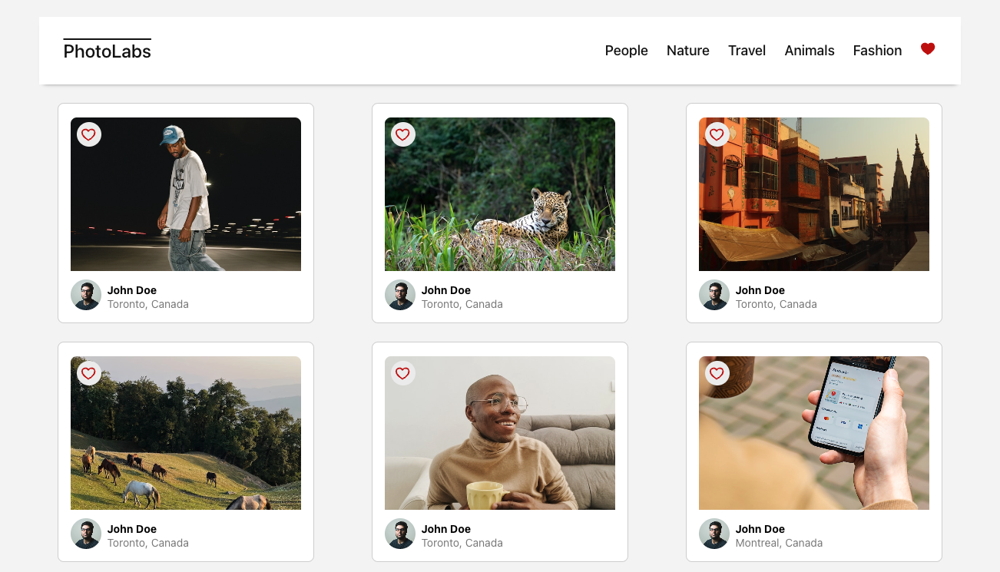
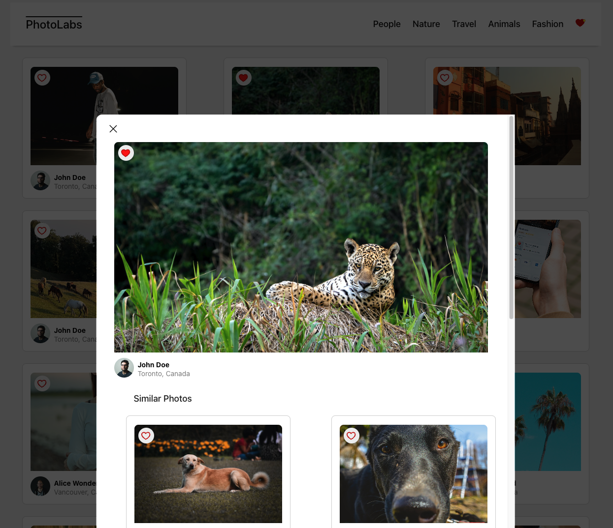

# PhotoLabs

The PhotoLabs project for the Lighthouse Labs Web Development bootcamp.

This project shows users photos with the option to favourite a photo with the heart icon or click on the photo to see a larger version of the image, along with similar photos. You can also click on the topics in the navigation bar to only see photos that are related to that topic.

It utilizes axios API calls to the backend to access the photo and topics data, which is all served up on a React front-end.

This project was bootstrapped with [Create React App](https://github.com/facebook/create-react-app).

# Getting Started with PhotoLabs

## Setup

Install dependencies with `npm install` in each respective `/frontend` and `/backend`.

## [Frontend] Running Webpack Development Server

```sh
cd frontend
npm start
```

In the project directory frontend folder, you can run `npm start` to start the app. It will run the app at 
[http://localhost:3000](http://localhost:3000) in your browser.

The page will reload when you make changes.

## [Backend] Running Backend Server

Read `backend/readme` for further setup details.

```sh
cd backend
npm start
```

In the project directory backend folder, you can run `npm start` to start the API server.

# Tech Concepts Practiced

This app uses the following concepts:
* useReducer (in lieu of useState)
* useEffect
* Event handlers
* Custom Hooks
* Components and Props
* Axios API GET requests

# Screenshots




